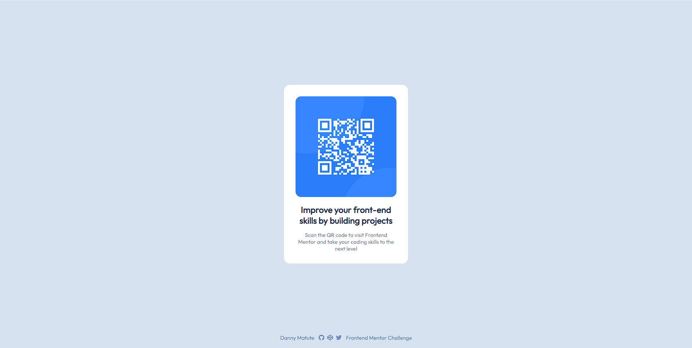

# Frontend Mentor - QR code component solution

Esta es una solución al [desafío del QR code component en Frontend Mentor](https://www.frontendmentor.io/challenges/qr-code-component-iux_sIO_H). Los desafíos de Frontend Mentor lo ayudan a mejorar sus habilidades de codificación mediante la creación de proyectos realistas.

## Tabla de contenido

- [Frontend Mentor - QR code component solution](#frontend-mentor---qr-code-component-solution)
  - [Tabla de contenido](#tabla-de-contenido)
  - [Resumen](#resumen)
    - [Captura de pantalla](#captura-de-pantalla)
    - [Enlaces](#enlaces)
  - [Mi Proceso](#mi-proceso)
    - [Herramientas](#herramientas)

## Resumen

El proyecto es simple. Sin embargo, es un buen ejercicio para empezar a desempolvar mis conocimientos adquiridos en React y SASS.

### Captura de pantalla

### Enlaces 

- Github Repository: [https://github.com/d4nnym/qr-code-component](https://github.com/d4nnym/qr-code-component) 
  
- Github Page: [https://d4nnym.github.io/qr-code-component/](https://d4nnym.github.io/qr-code-component/) 

## Mi Proceso 
### Herramientas

El proyecto fue construido con la idea de no utilizar librerías y frameworks aparte de la herramienta elegida para su construcción; el proyecto es simple de construir y es un buen ejerciió para empezar a poner práctica pequeñas herramientas. Utilicé React "vanilla" como librería para poner en práctica mis inicios en ella. Al igual que REact, en Sass no hice uso de ninguna librería ni framework.

- React 
- SASS 